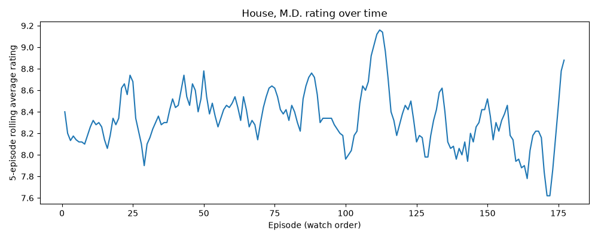

# Haus MD

A small data pipeline that pulls *House, M.D.* episode and ratings data out
of the full IMDb public dataset dump, builds a local DuckDB warehouse, runs
a couple of analyses on it, and plots the result — built as a hands-on way
to learn DuckDB, data pipeline structure, and data quality validation.

## Architecture

```
download.py   ingest.py    transform.py   validate.py   analyze.py   visualize.py
    │              │             │              │             │            │
    ▼              ▼             ▼              ▼             ▼            ▼
fetch raw    load filtered   join + rolling  hard-fail +    early/late   rolling-avg
.tsv.gz      IMDb tables     average table   warn checks    findings     plot (PNG)
files        (house_*)                       (data quality)
```

All of it runs end to end through [`pipeline.py`](pipeline.py), the single
entrypoint. Every pipeline stage is idempotent — tables use
`CREATE TABLE IF NOT EXISTS`, and `download.py` skips files that already
exist — so rerunning the whole thing is cheap and safe.

## Setup

```bash
make setup   # creates venv/, installs requirements.txt
make run     # downloads raw IMDb files if missing, builds the warehouse,
             # validates it, runs the analysis, writes output/rolling_avg.png
make test    # runs the test suite against small in-memory fixtures
```

No manual download step needed — `download.py` fetches
`title.basics.tsv.gz`, `title.episode.tsv.gz`, and `title.ratings.tsv.gz`
from https://datasets.imdbws.com/ into `data/` on first run (~280 MB
total) and skips any file that's already there on subsequent runs.

Schema and sample rows for each raw file are in
[`notes/datasets.md`](notes/datasets.md).

## Pipeline

Filtered down from the full IMDb dump to just *House, M.D.* (`tt0412142`):

1. **`house_basics`** — the show's own row from `title.basics`.
2. **`house_episodes`** — all 177 episodes whose `parentTconst` matches the
   show, from `title.episode`.
3. **`house_ratings`** — ratings for those 177 episode `tconst`s, from
   `title.ratings`.
4. **`house_full`** — `house_episodes` joined with `house_ratings`, one row
   per episode, ordered by season/episode (true watch order).
5. **`house_rolling`** — `house_full` plus a 5-episode rolling average of
   `averageRating`, to smooth noise and spot rating arcs over time.

## Data quality

[`validate.py`](validate.py) runs after every build, split into two tiers:

- **Hard checks** (raise and stop the pipeline): ratings outside `[1, 10]`,
  duplicate episode `tconst`s, non-positive vote counts, or any table
  coming back empty.
- **Warn-and-log** (don't stop the pipeline, just flag): episodes whose
  vote count is suspiciously low relative to the rest of the series. This
  general threshold rule — not a hardcoded exception — is what catches the
  finding below automatically.

## Findings

Full queries in [`analyze.py`](analyze.py).

- **Early vs. late season rating — take 1 (flawed):** a quick flat cutoff
  (`episodeNumber > 15` = "late") suggested late-season episodes rate
  noticeably higher (8.52 vs 8.27). But the split was badly uneven
  (120 early vs 57 late episodes) — a hint the cutoff itself was biased,
  since seasons have different episode counts (~20–24).
- **Early vs. late season rating — take 2 (fixed):** redefined "late" as
  "past the midpoint of *that specific* season" using a window function
  (`MAX(episodeNumber) OVER (PARTITION BY seasonNumber)`). With a fair,
  even split (87 vs 90 episodes), the gap mostly disappeared (8.40 vs
  8.29). Lesson: the first result was largely a measurement artifact, not
  a real effect — worth remembering before trusting any "obvious" first
  result.
- **Data quality quirk, caught by an automated check:** the series
  finale's `numVotes` (239) is way out of line with every other episode
  (2,700–9,000+), and its `tconst` is numerically much higher than the
  rest — usually a sign an IMDb entry was added long after the fact.
  Likely a re-tagged/duplicate entry splitting votes from an "original"
  finale row. `validate.py`'s outlier check flags this automatically on
  every run; it's a known, documented data quality issue rather than one
  silently "fixed" by guessing at IMDb's internal state.



## What this demonstrates

- An idempotent, staged pipeline (download → ingest → transform →
  validate → analyze → visualize) instead of one monolithic script.
- Explicit data quality checks with a hard-fail/warn split, not just prose
  comments about what looked off.
- Reproducibility from a clean clone — no manually-downloaded files
  required.
- Tests ([`tests/`](tests/)) that exercise the transform and validation
  logic against tiny fixtures, independent of the 280 MB real dataset.
- CI ([`.github/workflows/ci.yml`](.github/workflows/ci.yml)) running the
  test suite on every push.

## Learnings

DuckDB-specific notes (options like `nullstr`/`sample_size`, the `\N` null
placeholder gotcha, window functions vs. `GROUP BY`, etc.) are kept in
[`notes/duck.md`](notes/duck.md) as they came up.

## Next up

- Export `house_full` / `house_rolling` to Parquet.
- Maybe: outlier detection on individual episode ratings relative to their
  season's average (separate from the vote-count outlier check above).
